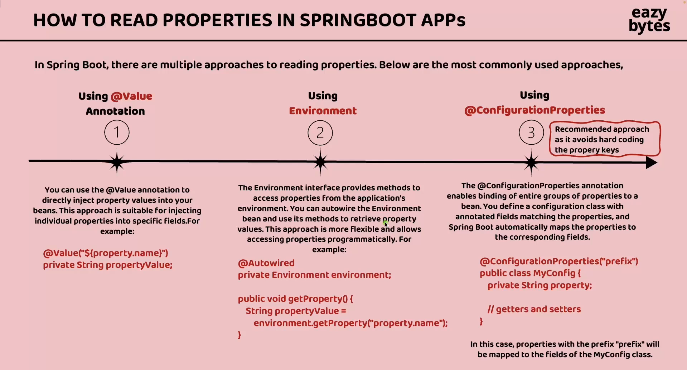

# Spring Boot Configuration Management — `@Value` Annotation

## What is `@Value`?
`@Value` is a Spring annotation used to inject configuration values into Spring-managed beans.


### It can read values from:
- `application.properties`
- `application.yml`
- Environment Variables
- JVM Arguments
- Spring Expression Language (SpEL)

### Basic Example 
```properties
app.name=Order Service
server.port=8081
```

```java
import org.springframework.beans.factory.annotation.Value;
import org.springframework.stereotype.Service;

@Service
public class OrderService {

    @Value("${app.name}")
    private String appName;

    public void printAppName() {
        System.out.println(appName);
    }
}

```

### Syntax
Property Placeholder

```java
@Value("${property.name}")
```

Default Value
```java
@Value("${app.version:1.0}")
private String version;
```

Injecting Primitive Types
```java
@Value("${app.timeout}")
private int timeout;

@Value("${app.enabled}")
private boolean enabled;

```

Constructor Injection
```java
@Service
public class PaymentService {

    private final String gatewayUrl;

    public PaymentService(
        @Value("${payment.gateway.url}") String gatewayUrl
    ) {
        this.gatewayUrl = gatewayUrl;
    }
}
```
Why Constructor Injection?
- Immutable fields
- Better testability
- Cleaner design
- Recommended Spring practice


### Different Resources 

1) application.yaml

```java
 name: Inventory Service

@Value("${app.name}")
private String appName;      

```

2) Reading Environment Variables
```aiignore
DB_PASSWORD=secret
```
```java
@Value("${DB_PASSWORD}")
private String password;
```

3) Spring Expression Language (SpEL)

```java
@Value("#{2 + 3}")
private int result;
```

4) Reading System Properties 
```java
@Value("#{systemProperties['java.version']}")
private String javaVersion;
```

5) Injecting Lists
```aiignore
app.roles=ADMIN,USER,GUEST
```
```java
@Value("#{'${app.roles}'.split(',')}")
private List<String> roles;
```

### Configuration Priority

Higher priority overrides lower priority.
Typical order:

1. Command Line Arguments
2. Environment Variables
3. application.properties
4. application.yml
5. Default Values


## Problems With @Value
1. Scattered Configurations
  ```java
@Value("${db.url}")
   private String url;

@Value("${db.username}")
private String username;

@Value("${db.password}")
private String password;
```
Configurations become difficult to manage.

2. No Type Safety
```java
   @Value("${db.usrename}")
```
   

Typo causes runtime failure.

No compile-time checking.

3. Hard to Maintain Large Configs
   
```properties
payment.retry.maxAttempts=3
payment.retry.delay=5000
payment.retry.enabled=true

```

Using multiple @Value fields becomes messy.

4. Weak Validation Support

Validation annotations are not naturally supported.

Example:

```properties
@NotNull
```

works better with @ConfigurationProperties.


