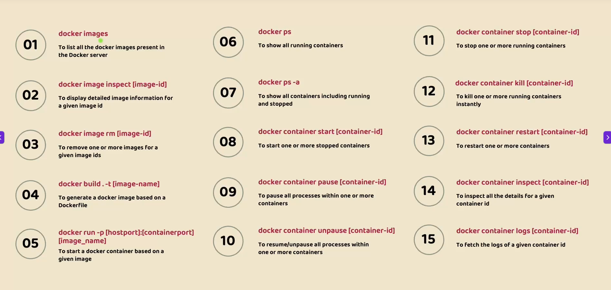
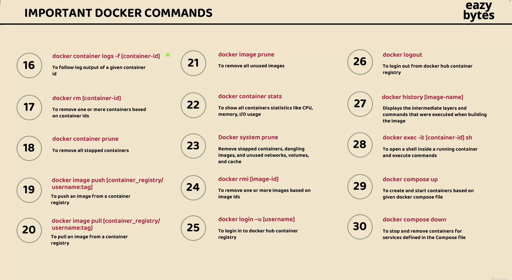
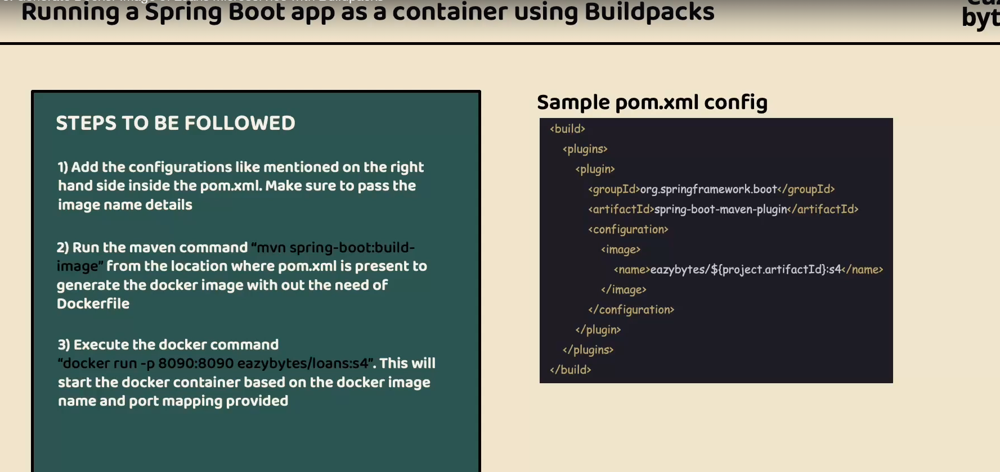
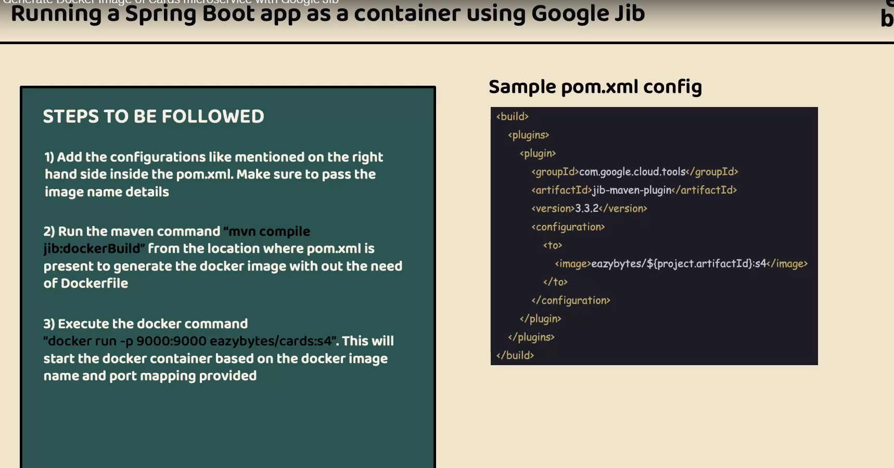

# Docker Commands Reference







# Generate Docker Image Using Docker File 
## Build Commands

### Build Spring Boot JAR
```bash
# Clean previous builds and create a new packaged JAR file
# This compiles the code, runs tests, and packages everything into target/Account-0.0.1-SNAPSHOT.jar
mvn clean install
```

### Build Docker Image
```bash
# Build a Docker image from the Dockerfile in current directory (.)
# -t tags the image with a name and version
# Format: username/repository:tag
# nagarjun20 = Docker Hub username
# accounts = repository name
# s1 = version/tag
docker build . -t nagarjun20/accounts:s1
```

## Image Management Commands

### List All Docker Images
```bash
# Display all Docker images on your local machine
# Shows: REPOSITORY, TAG, IMAGE ID, CREATED, SIZE
docker images
```

### Inspect Docker Image
```bash
# View detailed information about a specific image
# 338d = short form of image ID (first 4+ characters)
# Shows: layers, environment variables, exposed ports, entry point, etc.
docker image inspect 338d
```

## Run Commands

### Run Spring Boot Application (Development)
```bash
# Run the application directly using Maven without packaging
# Compiles code and starts the embedded server
# Good for development with hot reload
mvn spring-boot:run
```

### Run Spring Boot JAR (Production)
```bash
# Run the packaged JAR file directly
# Starts the application with embedded Tomcat server
# Default port: 8080
java -jar .\target\Account-0.0.1-SNAPSHOT.jar
```

### Run Docker Container
```bash
# Run a container from the built image
# -p maps host port to container port (host:container)
# -d runs in detached mode (background)
# --name gives the container a custom name
docker run -p 8080:8080 -d --name accounts-container nagarjun20/accounts:s1


docker run -d -p 8080:8080 nagarjun20/accounts:s1
```

## Additional Useful Commands

### Stop Running Container
```bash
# Stop a running container gracefully
docker stop accounts-container
```

### Remove Container
```bash
# Remove a stopped container
docker rm accounts-container
```

### Remove Image
```bash
# Remove a Docker image from local machine
docker rmi nagarjun20/accounts:s1
```

### View Running Containers
```bash
# List all running containers
docker ps

# List all containers (including stopped)
docker ps -a
```

### View Container Logs
```bash
# View logs from a running container
# -f follows the log output (like tail -f)
docker logs -f accounts-container
```

### Push Image to Docker Hub
```bash
# Login to Docker Hub
docker login

# Push your image to Docker Hub repository
docker push nagarjun20/accounts:s1
```

### Pull Image from Docker Hub
```bash
# Download an image from Docker Hub
docker pull nagarjun20/accounts:s1
```

## Build Workflow Summary

```bash
# 1. Build the JAR file
mvn clean package

# 2. Build the Docker image
docker build . -t nagarjun20/accounts:s1

# 3. Run the container
docker run -p 8080:8080 -d --name accounts-container nagarjun20/accounts:s1

# 4. Check if it's running
docker ps

# 5. View logs
docker logs accounts-container

# 6. Test the application
curl http://localhost:8080
```

## Common Options Explained

- `-t` : Tag the image with a name
- `-p` : Port mapping (host:container)
- `-d` : Detached mode (run in background)
- `--name` : Assign a name to the container
- `-f` : Follow/tail logs in real-time
- `-a` : Show all (including stopped containers)
- `.` : Current directory (build context)


## Disadvantages of Using Dockerfile

### 1. Large Image Sizes
- Full JDK images are ~400MB when you only need JRE (~200MB smaller)
- Includes unnecessary compilers, debuggers, and build tools at runtime
- Results in slower downloads, more storage usage, and larger attack surface
- **Solution**: Use JRE base images or distroless images instead of JDK

### 2. Layer Caching Issues
- Any file change invalidates cache and triggers complete rebuild
- Even README changes can force Maven to redownload all dependencies
- Leads to slow, repetitive builds during development
- **Solution**: Copy `pom.xml` first, install dependencies, then copy source code

### 3. Security Vulnerabilities
- Default containers run as root user (security risk)
- Base images may contain outdated or vulnerable packages
- Easy to accidentally include secrets in image layers
- **Solution**: Use non-root users, scan images regularly, use `.dockerignore`

### 4. Build Dependencies in Final Image
- Build tools (Maven, Gradle) remain in production image
- Source code and intermediate files waste space
- Can add 500MB+ of unnecessary bloat
- **Solution**: Use multi-stage builds to separate build and runtime

### 5. No Standardization
- Every developer writes Dockerfiles differently
- Inconsistent base images and security practices across teams
- Difficult to enforce best practices organization-wide
- **Solution**: Use Buildpacks or Jib for automated, standardized builds

### 6. Manual Optimization Required
- Need to understand layer ordering, caching strategies
- Easy to make mistakes that bloat images or slow builds
- Steep learning curve for Docker best practices
- **Solution**: Use automated tools like Buildpacks or Jib

### 7. Large Build Context
- `docker build .` sends entire directory to Docker daemon
- Transfers unnecessary files (.git, node_modules, IDE configs)
- Slows down build process significantly
- **Solution**: Use `.dockerignore` file to exclude unnecessary files

### 8. Platform-Specific Issues
- Images built on ARM (Mac M1/M2) may not run on x86 servers
- Cross-platform compatibility requires additional configuration
- **Solution**: Use `--platform` flag or Docker buildx for multi-arch builds

### 9. Limited Reproducibility
- Same Dockerfile can produce different images over time
- Base image updates and package versions change unpredictably
- Difficult to guarantee exact same image in future builds
- **Solution**: Pin specific image versions and package versions

### 10. Difficult Debugging
- Hard to debug failed intermediate layers
- No interactive stepping through build process
- Cryptic error messages from failed commands
- **Solution**: Use `docker build --progress=plain` or build stages interactivel


# Generate Docker Image with BUILDPACKS



# 🐳 Cards Microservice – Docker Image using Spring Boot Buildpacks

This project demonstrates how to generate and run a Docker image for a Spring Boot microservice using **Spring Boot Buildpacks** (no Dockerfile required).

---

## 🚀 Prerequisites

Before you begin, make sure you have:

* Java 21 installed
* Maven installed
* Docker installed and running

---

## ⚙️ Spring Boot Maven Plugin Configuration

Ensure the following plugin is configured in your `pom.xml`:

```xml
<plugin>
    <groupId>org.springframework.boot</groupId>
    <artifactId>spring-boot-maven-plugin</artifactId>
    <configuration>
        <image>
            <name>nagarjun20/cards:s1</name>
        </image>
        <excludes>
            <exclude>
                <groupId>org.projectlombok</groupId>
                <artifactId>lombok</artifactId>
            </exclude>
        </excludes>
    </configuration>
</plugin>
```

---

## 🏗️ Step 1: Build Docker Image

Run the following command:

```bash
mvn spring-boot:build-image
```

### 🔍 What this does:

* Compiles the application
* Packages it as a JAR
* Uses **Cloud Native Buildpacks** to create a Docker image
* Tags the image as: `nagarjun20/cards:s1`

---

## 📦 Step 2: Verify Docker Image

Check if the image is created:

```bash
docker images
```

You should see:

```
nagarjun20/cards   s1   <image-id>
```

---

## ▶️ Step 3: Run Docker Container

Run the container using:

```bash
docker run -p 9000:9000 -d --name cards-container nagarjun20/cards:s1
```

### 🔍 Explanation:

* `-p 9000:9000` → Maps container port to local port
* `-d` → Runs container in detached mode
* `--name cards-container` → Assigns container name

---

## 🌐 Step 4: Access the Application

Open your browser:

```
http://localhost:9000
```

---

## 🛑 Stop and Remove Container

```bash
docker stop cards-container
docker rm cards-container
```

---

## 🧠 Key Concept: Buildpacks vs Dockerfile

| Feature      | Buildpacks           | Dockerfile                |
| ------------ | -------------------- | ------------------------- |
| Setup        | No Dockerfile needed | Manual setup              |
| Ease         | Very easy            | Requires Docker knowledge |
| Optimization | Automatic            | Manual                    |
| Use Case     | Microservices        | Custom environments       |

---

## ⚠️ Common Issues

### ❌ Docker not running

```
Cannot connect to the Docker daemon
```

👉 Start Docker and retry.

---

### ❌ Cached Maven errors

Run:

```bash
mvn clean install -U
```

---

## 📌 Summary

* Use `spring-boot:build-image` to create Docker images
* No Dockerfile required
* Run container using `docker run`
* Access app via exposed port

# 🐳 Loans Microservice – Docker Image using Google Jib


This project demonstrates how to build a Docker image for a Spring Boot microservice using **Google Jib Maven Plugin** — without needing a Dockerfile or Docker daemon.

---

## 🚀 Prerequisites

Make sure you have:

* Java 21 installed
* Maven installed
* (Optional) Docker installed → only needed if you want to run the container locally

---

## ⚙️ Jib Maven Plugin Configuration

Add the following plugin to your `pom.xml`:

```xml
<plugin>
    <groupId>com.google.cloud.tools</groupId>
    <artifactId>jib-maven-plugin</artifactId>
    <version>3.5.1</version>
    <configuration>
        <to>
            <image>nagarjun20/loans:s1</image>
        </to>
    </configuration>
</plugin>
```

---

## 🏗️ Step 1: Build Docker Image (as TAR)

Run the following command:

```bash
mvn compile jib:buildTar
```

---

## 📦 What This Does

* Compiles your application
* Packages it into layers (optimized for caching)
* Builds a Docker image
* Exports it as a `.tar` file (instead of pushing to Docker directly)

👉 Output file will be created in:

```bash
target/jib-image.tar
```

---

## 📥 Step 2: Load Image into Docker

If you want to run the image locally:

```bash
docker load -i target/jib-image.tar
```

---

## ▶️ Step 3: Run Docker Container

```bash
docker run -p 9000:9000 -d --name loans-container nagarjun20/loans:s1
```

---

## 🌐 Step 4: Access Application

Open in browser:

```bash
http://localhost:9000
```

---

## 🧠 Why Use Jib?

| Feature                | Jib              |
| ---------------------- | ---------------- |
| Dockerfile required    | ❌ No             |
| Docker daemon required | ❌ No (for build) |
| Layered builds         | ✅ Yes            |
| Fast rebuilds          | ✅ Yes            |
| CI/CD friendly         | ✅ Excellent      |

---

## 🔄 Alternative Commands

### 🔹 Build and push directly to Docker Hub

```bash
mvn compile jib:build
```

👉 Requires Docker Hub credentials configured.

---

### 🔹 Build directly to local Docker daemon

```bash
mvn compile jib:dockerBuild
```

---

## ⚠️ Common Issues

### ❌ Port not accessible

Ensure your Spring Boot app is running on:

```properties
server.port=9000
```

---

### ❌ Image not found after build

Run:

```bash
docker images
```

---

## 📌 Summary

* Jib builds Docker images without Dockerfile
* `jib:buildTar` → creates portable image file
* `docker load` → loads image locally
* `docker run` → runs container

---


# 🚀 Pushing Local Docker Images to Docker Hub

This guide explains how to push locally built Docker images (e.g., `cards`, `loans`, `accounts`) to a remote Docker Hub repository.

---

## 📦 Prerequisites

Make sure you have:

* Docker installed and running
* A Docker Hub account → https://hub.docker.com
* Local Docker images already built

---

## 🔍 Step 1: Verify Local Images

List all local images:

```bash
docker images
```

Example:

```
REPOSITORY              TAG
nagarjun20/cards        s1
nagarjun20/loans        s1
nagarjun20/accounts     s1
```

---

## 🔐 Step 2: Login to Docker Hub

```bash
docker login
```

👉 Enter your Docker Hub credentials:

* Username: `nagarjun20`
* Password / Access Token

---

## 🏷️ Step 3: Tag the Image (If Required)

If your image is **not already in the correct format**, tag it:

```bash
docker tag <local-image> <dockerhub-username>/<repo>:<tag>
```

### Example:

```bash
docker tag cards:latest nagarjun20/cards:s1
```

👉 Skip this step if your image already looks like:

```
nagarjun20/cards:s1
```

---

## ⬆️ Step 4: Push Image to Docker Hub

Push the image:

```bash
docker push nagarjun20/cards:s1
```

Repeat for other services:

```bash
docker push nagarjun20/loans:s1
docker push nagarjun20/accounts:s1
```

---

## 🌐 Step 5: Verify on Docker Hub

Go to: https://hub.docker.com

👉 You should see your repositories:

* `cards`
* `loans`
* `accounts`

---

## 🧠 Naming Convention (Best Practice)

| Service  | Image Name               |
| -------- | ------------------------ |
| Cards    | `nagarjun20/cards:s1`    |
| Loans    | `nagarjun20/loans:s1`    |
| Accounts | `nagarjun20/accounts:s1` |

---

## ⚠️ Common Errors & Fixes

### ❌ `tag does not exist`

👉 Run:

```bash
docker images
```

Ensure correct name and tag.

---

### ❌ `denied: requested access to the resource is denied`

👉 Fix:

* Run `docker login`
* Ensure repo name matches your username

---

### ❌ Wrong repository name

👉 Example mistake:

```
card ❌ vs cards ✅
```

---

## 🚀 Full Workflow (Quick Reference)

```bash
docker images
docker login
docker push nagarjun20/cards:s1
docker push nagarjun20/loans:s1
docker push nagarjun20/accounts:s1
```

---

## 💡 Pro Tips

* Use meaningful tags:

    * `v1`, `v2`, `latest`
* Keep naming consistent across microservices
* Avoid typos (`card` vs `cards`)

---


